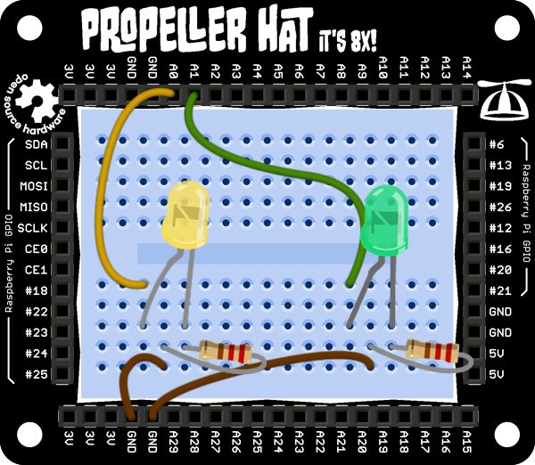

#Diving Into Multicore

You probably didn't pick up Propeller HAT because it was some ordinary, run-of-the-mill Microcontroller board. No siree.
You want to take advantage of those 8 cores and play to the Propeller's strengths.

Well, fortunately, it's really not all that hard.

###What's a cog, got to do, got to do with it?

In the world of Propeller, where almost everything is a pun based on the name of the chip, you'll often find the cores
referred to as "cogs". The Propeller has 8 cogs, and ( wait for it... ) a "hub".


####The Hub

The Hub is the central controller of the Propeller, it houses the lion's share of the chips memory/storage - 8192, 32-bit
longs ( also known as 32kb or 32,768 bytes ). The Hub's job is to dish out tasks to the Cogs, control their access to its
memory and make sure they don't fight over resources or tread on each other's toes.

In other words, the Hub is the boss! What it doesn't have, however, is the ability to run code. The Hub sits in its tiny
silicon throne and dishes out commands, but it can't execute any itself. The Hub relies wholly and totally on the Cogs to carry
out their instructions and only gets involved when they need to communicate, share data or receive new sets of instructions.

The Hub also has some other fancy features, such as configuration registers and lock bits- we won't worry about those yet!

####The Cogs

Now. Onto the Cogs. Each Cog has 512, 32-bit longs ( also known as 2kb or 2048 bytes ) of memory. This memory serves as both
storage for the instuctions that Cog has been told to execute, and as running memory for remembering what it's doing.

2kb is a pretty decent amount of memory for a Cog, but you have to be mindful that the larger your running code is, the less
space will be available for it to store what it's working on. Think of it like filling a frying pan- the more food you pop
into the frying pan the less space you have to stir it!

Alongside the memory, each Cog has its own CPU capable of executing the instructions its given, it also has its own
counters and video generator- but we'll worry about those later too.

The most important thing to remember is that each one of the 8 Cogs has its own DIRA and OUTA register for setting the
direction and output state of all 32 IO pins on the Propeller. When you're passing a function or code to a Cog you need
to make sure that the Cog sets up its own DIRA register, since setting the direction of a pin elsewhere will likely happen
in another Cog and lead to confusing results!

###Now, for some code!

```spin
CON
  _CLKMODE = xtal1 + pll16x
  _XINFREQ = 6_000_000

  MY_LED_PIN = 0 ' Use pin A0
  SECOND_PIN = 1 ' Use pin A1

VAR
  long stack[128] ' Allocate 128 longs of stack space for our new COG

PUB main
  cognew(blink_second_pin, @stack) ' Start a new COG
    
  DIRA[MY_LED_PIN] := 1 ' Set the LED pin to an output

  repeat ' Repeat forever
    OUTA[MY_LED_PIN] := 1   ' Turn the LED on
    waitcnt(cnt + clkfreq)  ' Wait 1 second 
                            ' cnt is the clock tick counter, 
                            ' clkfreq is the number of clock ticks in a second
    OUTA[MY_LED_PIN] := 0   ' Turn the LED MY_LED_PIN
    waitcnt(cnt + clkfreq)  ' Wait 1 second

PUB blink_second_pin
  DIRA[SECOND_PIN] := 1
  
  repeat
    OUTA[SECOND_PIN] := 1    ' Turn second LED on
    waitcnt(cnt + clkfreq/2) ' Wait half a second
    OUTA[SECOND_PIN] := 0    ' Turn second LED off
    waitcnt(cnt + clkfreq/2) ' Wait half a second
```

You'll notice that the simple act of launching a new Cog has introduced a lot of extra code to our program. Let's
break it down again...

####blink_second_pin

The majority of this is the work we actually want the Cog to do, which is all contained within the PUBlic method
`blink_second_pin`. It's very similar to our main public method because it's blinking another pin.

To make it clear that the second Cog is running, we pick a different pin, and a faster blink rate.

As before, we use a CONstant to define which pin we'd like to blink, in this case in A1.

####clkfreq/2

Since `clkfreq` is the number of clock ticks in a single second, we can incur a wait of half a second simply by
dividing it by two.

####DIRA and OUTA strike again

Every single Cog has its own DIRA and OUTA registers, so it's absolutely imperative to remember to set the direction
of the pin you want to use before trying to change its value. If you forget to set a pin to an output 
(`DIRA[PIN] := 1`) then it wont output its value when you change it (`OUTA[PIN] := X`).

####cognew

This example introduces another feature of SPIN, the `cognew`<sup>1</sup> command. Cognew does what it says on the tin, and
initiates a new Cog to run the SPIN method that you pass it. Cognew has a cousin known as `coginit` which also runs
a spin method in a Cog, but instead of finding the first available unused Cog it gives a new task to the one you specify.

At this point, it's important to note that the code calling `cognew` is running in a *Cog* and not the *Hub*. So this means you have 7 remaining Cogs to run 7 additional tasks.

The `cognew` command has a second required parameter, the stack pointer...

####stack

A new `VAR` section has made its way into this example too. In this instance our only variable is the
stack<sup>2</sup> we want to reserve for our new Cog. This is a portion of Hub memory which the Cog can use to 
store temporary data that it needs to carry it its task.

When we call `cognew` we pass it the stack variable, the `@` prefix gives us the address of our `stack` array,
rather than its value. Giving it the address means that the newly iniated Cog will know that it's safe to store
values at this location. The stack should always be sized appropriately for whatever task the Cog is allocated.
At this stage we don't really care about optimisation, so we'll use a "safe" and spacious stack that's 128 32-bit
longs in size.

If you've ever come across the term "stack overflow", it's what happens when an application tries to use more stack
space than there has been allocated for it- this means it'll try and store things in memory locations after the
stack which have potentially been reserved for something else.

#Wiring up your Propeller HAT

To see the result of this code, you'll need a couple of LEDs plugged into outputs A0 and A1, like so:




#Further Reading

* <sup>1</sup> A little more detail about Cogs: http://www.parallax.com/propeller/qna/Default.htm#QnaTopics/QnaCogs.htm
* <sup>2</sup> Learn more about the need for Stack on Propeller Cogs: http://www.parallax.com/propeller/qna/Default.htm#CodeTeqTopics/StackSpace.htm
